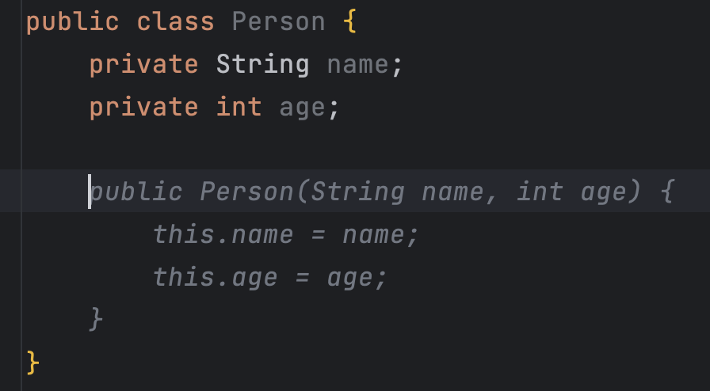

# 特别加餐 | ChatGPT来了，你的编程效率提高了吗？
    

程序员是一个追求效率的群体，我们的日常工作就是为别人打造提升效率的工具，自然而然的，我们也会不断要求自己**优化自身工作效率**。《10x 程序员工作法》这个专栏，谈的就是程序员应该如何从方方面面努力提升自己的工作效率。但工作效率这件事在 ChatGPT 诞生之后，就需要重新讨论一下了。

ChatGPT 本身并不是一个为程序员准备的工具，但当 ChatGPT 破圈后，所有人都开始重新思考如何利用 AI 技术提升自己的工作效率，程序员当然也不例外。这里我加餐一篇，讨论一下程序员在提升效率这条路上是怎么一路走过来的。

## 从命令行开始

程序员在工作效率上的优化是从命令行开始的。最初，命令行是为了方便用户与操作系统进行交互，完成一些简单的任务。但程序员很快就发现，命令行也可以很好地提升工作效率。

举个例子，假设一个程序员需要从一个巨大的日志文件中提取出某些信息，并将其转化为 CSV 格式的文件，以便进一步进行分析。如果使用传统的文本编辑器完成这个任务，不仅效率低下，还很容易出错。但如果使用命令行工具，就可以轻松地完成这个任务。比如，我们使用下面这条命令。

```shell
grep "error" log.txt | awk -F ':' '{print $1 "," $3}' > output.csv

```

这个命令的意思是，首先使用 **grep** 命令从 log.txt 文件中找到包含关键字 “error” 的行，然后将结果通过管道符号（|）传递给 **awk** 命令，使用冒号作为分隔符，提取每行的第一列和第三列，并使用逗号将它们连接起来。最后，使用输出重定向符号将处理后的结果保存到 output.csv 文件中。这样就能够一次性完成所有的任务，大大提高工作效率。

当一个程序员学会使用命令之后，能做的工作会越来越复杂，很多时候，我们要根据一个命令执行的结果，再执行下一条命令，这时就轮到脚本登场了。

简单来理解，脚本就是多个命令的组合，通过它可以完成更加复杂的工作。例如，在 Linux 中，我们可以使用 shell 脚本执行一系列命令，从而批量地完成一些工作，如自动备份、批量转换文件格式等。在 Windows 中，使用 PowerShell 脚本可以完成类似的任务。

脚本的另一个优点可以保存下来，以备复用。当需要反复执行某些任务时，只需要运行相应的脚本即可，这就大大提高了工作效率。例如，一个编译环境的设置需要进行多个操作，包括修改环境变量、安装依赖包等，每次配置新的编译环境都需要重复执行这些操作。而如果将这些操作写成脚本，就可以轻松地重复使用，大大减少了重复工作的时间和精力。事实上，你会看到，很多开源软件的安装就是通过脚本完成的（比如 [Homebrew](https://brew.sh/)）。

稍微了解一下，我们便不难发现，有一些工具就是基于命令行和脚本衍生出来的，最典型的例子就是持续集成工具。持续集成最初就是几个命令行脚本，随着需求的增加再加上功能不断开发，才有了我们今天看到的各种持续集成工具。

## 编辑器和IDE

程序员的本职工作是写代码，但怎么把代码写出来这件事本身也经历过很大的转变。想必很多人刚开始学习写代码时，都是一个字母一个字母地敲出来。但如果你想以程序员作为职业的话，这种工作方式无疑是低效的。

今天程序员的工作主要是在编辑器或 IDE 中完成，编码效率的提升首先就是用好快捷键。相比于拿着鼠标在菜单里一项项找过去，按一个快捷键就能快速地开始一段工作显然是效率更高的。

比如我们要找一个类，在 IntelliJ IDEA 里，我们可以通过 **Ctrl+N** 调起一个窗口，输入类名，回车之后就可以跳转过去，这显然比在文件树中一个个找过去要快得多。编写代码的时候，我们可以通过按下 **Alt+Enter** 利用 IDEA 给出的提示快速修复一些问题，还可以通过 Shift+F6 给一个变量或函数改名。这些快捷键可以最大限度减少手离开键盘的次数，从而保证编码流程的连贯性，极大地提高编码速度。

熟练掌握一款编辑器或 IDE 的快捷键是需要投入时间练习的，但这是程序员提高工作效率的一条重要途径。相对其他更专业的内容而言，它可以称得上是“投资少、见效快”。

另外一个非常实用的功能就是代码模板。通过输入简短的几个字母，就能够自动生成一段完整的代码。还以 IntelliJ IDEA 为例，它提供了许多代码模板，比如，输入 **psvm** 按下 **Tab**，就可以生成一段标准的 main 函数。

```shell
public static void main(String[] args) {        
}

```

再比如，输入 fori 按下 **Tab**，就可以生成一段 for 循环。

```shell
for (int i = 0; i < ; i++) {            
}

```

我们要做的只是在光标闪动的地方做一些调整，比如，修改循环变量的名字，或是指定循环的长度等等。

在实际的编码中，我们还可以通过结合快捷键和代码模板进一步提高编写代码的效率。例如，在 IntelliJ IDEA 中，可以使用快捷键 Ctrl+Alt+T 快速生成一个代码块，这其实就是一种代码模板，可以用来快速生成代码。这样一来，我们就可以在短时间内完成大量的编码工作，提高工作效率。

当然，除了快捷键和代码模板外，各种编辑器和 IDE 还提供了许多其他的功能，帮助程序员提升工作效率（比如代码补全）。虽然我这里用 IntellIJ IDEA 做了例子，但这些能力几乎是所有主流编辑器的标配，甚至是那些并不是为程序员设计的编辑器都有类似的功能。由此可见，对于效率的追求是一个普遍的诉求。

## 进入 AI 时代

之前讨论的内容都属于前 AI 时代，但我们今天已经进入了 AI 时代。在AI 时代该怎么写程序呢？

尽管在许多人畅想的 AI 时代里，程序员可能是一个被 AI 取代的角色，但真实世界的路还是要一步一步走的。至少目前来看，工具取代程序员的路依旧很长。目前具有 AI 能力并得到广泛接受的工具，应该是 [Github Copilot](https://github.com/features/copilot/)。

Github Copilot 的设计是帮助我们更高效地写代码。装好 Github Copilot 之后，即便你对它的用法一无所知，直接写代码时，你就发现它会给你直接的提示，你只要 **Tab** 一下就可以接受它的建议。显然，Github Copilot 最简单的用法就是把它当做一个更好的代码补全（Code Completion）。



这还只是让它帮我们在局部编写代码，我们甚至可以让它编写整个函数。在这里，我们只要在注释里把意图告诉它，就像下面这样，Github Copilot 就可以根据我们的意图生成相应的代码。如果你觉得它写得还不错，就按下 **Tab** 接受这个结果，不满意的话，可以按 **Esc** 取消。


这还是一个比较简单的例子，有时候，我们需要做的事情稍微复杂一点，就像下面这个例子里，需要判断名字里是否只包含汉字。


大多数人对于怎么用正则表达式判断汉字这件事都不那么熟，通常的做法就是用搜索引擎去搜索具体的做法，然后再回到 IDE 继续代码编写工作。而有了 Github Copilot，它可以帮我们把两个工作合二为一了。我只要提出我的要求，它就可以帮我们把这项任务完成。不离开 IDE，减少不同窗口之间的切换，这就是对工作效率的提升。

当然，从体验上说，Github Copilot 并不那么完美，总有些用起来不那么流畅的地方，不如前面提到的各种提升效率方案用起来那么丝滑，但这是可以改进的，毕竟它还年轻。

有一点我们要知道，Github Copilot 是早于 ChatGPT 出现的。所以在ChatGPT 出现之后，很多软件的交互方式都会得到重新设计。在这点上，微软系的产品都是走在前列的（无论是很多人已经用上的 New Bing还是重新设计的 Office 系列），同属微软系的 Github 自然也不会落后于几个兄弟太多。[Github Copilot X](https://github.com/features/preview/copilot-x) 就是这样思想的产物，它也借鉴了 ChatGPT 的交互方式，让我们可以通过对话的方式进行代码的编写。

当然，如果你对如何利用人工智能感兴趣，可以到 [Github Next](https://githubnext.com/) 上看看，那里有很多 Github 正在开发的工具，当它们都成熟的那一天，我们的开发效率就会得到进一步提升。

## 总结时刻

今天，我们讨论了程序员在开发效率上的提升是怎样一路走过来的，我们从命令行和脚本，谈到了编辑器和 IDE 上的操作，再进一步谈到 AI 时代的开发工具。

其实，AI 时代的开发工具并不是只有 Github Copilot，亚马逊为我们提供了类似于 Github Copilot 的 [Codewhisperer](https://aws.amazon.com/codewhisperer/)，用法上大同小异，而且号称免费。我也见到了很多人编码的时候，屏幕的一角放在 ChatGPT 或者是 New Bing，随时随地与它们进行交流，让它们协助写代码或者改 Bug。

至少在今天来看，AI 扮演的角色还只是 Copilot（副驾驶），而主驾驶是我们。所以，我们更应该思考的问题是如何利用 AI 写好代码。是否善于利用工具，会造成人和人之间巨大的差异。就像不会用快捷键和代码模板的程序员，就只能慢吞吞地敲代码，而会用的程序员简直是批量地在生成代码。

同样的事情也会发生在这些 AI 工具上，无论是 Github Copilot，还是 Copilot X，其最大的进步是我们可以用自然语言描述意图，通过这种方式进行编码，“写”代码这个过程本身已经不再是程序员效率的阻碍。**能否向 AI 提出合适的问题，会变成未来程序员的技能上的核心差异。**

AI 目前帮我们提升的是操作层面的效率，而我们在这个专栏里讲的工作原则：以终为始、任务分解、沟通反馈和自动化，依然是有效的。把这些工作原则与 AI 结合，我们的工作效率还会进一步得到提升，这才是我们应该不断追求的。

如果今天的内容你只能记住一件事，那请记住：**拥抱 AI 时代，不断提升自己的工作效率**。
    