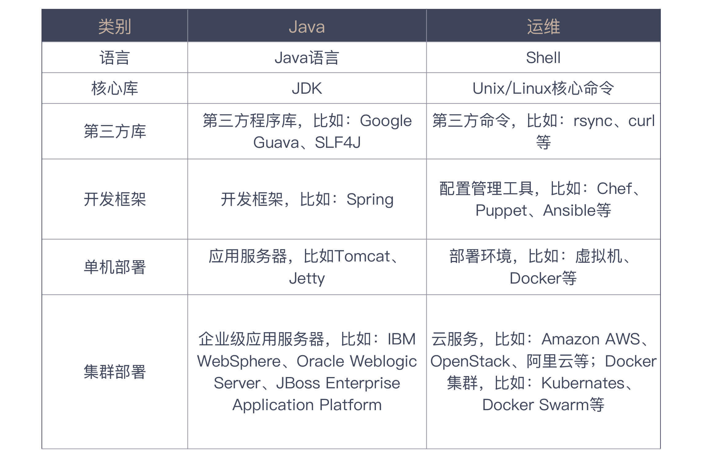

# 31 | 程序员怎么学习运维知识？
    

在上一讲中，我们讲到了开发过程的自动化，我们的关注点在于如何构建出一个有效的部署包，这个包最终是要上线部署的，那接下来，我们就来关心一下部署的相关工作。

## 零散的运维知识

在一些稍具规模的公司，为部署工作设置了一个专有职位，称之为运维。当然，这个岗位的职责远不止部署这一件事，还要维护线上系统的稳定。不过，如果你的团队规模不大，或是项目处于初始阶段，这些工作往往也要由程序员自行完成。

对于一个程序员来说，了解自己的程序怎么部署上线，是非常重要的。我们既要了解一个软件的逻辑，也要知道它的物理部署。只有这样，出了问题才知道怎么修复。

更重要的是，我们在设计时，才能尽量规避部署带来的问题。而部署，恰恰也是最适合发挥自动化本领的地方。

好，即便下定决心准备学习运维相关知识，你准备怎么学呢？我先来问你个问题，提到运维，你会想到什么？

如果你是一个刚刚步入这个行业的程序员，你或许会想到 [Docker](http://www.docker.com)，想到 [Kubernetes](http://kubernetes.io)；如果再早一点入行，你或许还会想到 [Chef](http://www.chef.io)、[Puppet](http://puppet.com)、[Ansible](http://www.ansible.com)；更早一些入行的话，你会想到 Shell 脚本。没错，这些东西都是与运维相关的。那我就这么一个一个地都学一遍吗？

就我个人的学习经验而言，如果所有的知识都是零散的，没有一个体系将它们贯穿起来，你原有的知识无法帮助你学习新知识，这种学习方式效率极低，过程也极其痛苦。

如果是有结构的知识，所谓的学习新知识不过是在学习增量，真正要理解的新东西并不多，学习效率自然会大幅度提高。所以，想学好运维知识，首先你要建立起一个有效的知识体系。

你可能会问，这些运维知识看上去就是一个一个独立的工具啊？我曾经也为此困惑了许久，虽然我对各个工具已经有了不少的了解，但依然缺乏一个有效的知识体系，将它们贯穿起来，直到我上了一堂课。

感谢 Odd-e 的[柴锋](https://chaifeng.com/about/)，有一次，他给我上了一堂 [DevOps 课](http://chaifeng.com/devops-tech-stack/)，他对运维知识的讲解让我茅塞顿开，从此，我的运维知识有了体系。

准确地说，他的这堂课就是讲给程序员的运维课。今天，我就把这个体系按照我的理解，重新整理一遍分享给你，也算是完成一次[知识输出](http://time.geekbang.org/column/article/84663)。

好，我们开始！

## Java 知识体系

正如我前面所说，学习一个新东西，最好的办法是学习增量，如果能够找到它与已有知识体系的联系，我们就可以把已有知识的理解方式借鉴过去。

作为程序员，我们其实已经有了一个完善的知识体系，这就是我们对于程序设计的理解，而理解运维的知识体系，刚好可以借鉴这个体系。怎么理解这句话呢？

以最常见的 Java 开发为例，如果要成为一个合格的 Java 程序员，我应该知道些什么呢？

首先肯定是 Java 语言，我需要了解 Java 语言的各种语法特性。不过，只了解语法是写不出什么像样程序的，我们还需要掌握核心库。

对于 Java 来说，就是 JDK 中的各种类，比如，最常见的 String、List、Map 等等。

理论上来说，掌握了基本的语法和核心库，你就可以开发任何程序了。但在实践中，为了避免重新发明“轮子”，减少不必要的工作量，我们还会用到大量的第三方类库，比如，[Google Guava](http://github.com/google/guava)、[SLF4J](http://www.slf4j.org) 等等。

除了功能实现，还有一些结构性的代码也会反复出现。比如说，在常见的 REST 服务中，我们要将数据库表和对象映射到一起，要将结果转换成 JSON，要将系统各个组件组装到一起。

为了减少结构上的代码重复，于是，开发框架出现了，在 Java 中最常见的开发框架就是 [Spring](http://spring.io)。

至此，你就可以完成基本的代码编写，但这还不够。

在 Java 中，你不会从底层完成所有事情，比如，虽然你写 REST 服务，但你很少会接触到最底层的 HTTP 实现，因为这些工作由运行时环境承担了。

我们要做的只是把打好的包部署到这些运行时环境上，在 Java 的世界里，这是 Tomcat、Jetty 之类的容器承担的职责。

如果你刚刚加入这一行，上来就用 Spring Boot 之类的框架写代码，你可能并没有碰到这样的部署过程，因为这些框架已经把容器封装其中，简化了部署过程。

Tomcat、Jetty 往往还只是在一台机器上部署，在现实的场景中，一台机器通常是不够用的，我们可能需要的是一个集群。

你可能会想到用 Nginx 来做一个负载均衡，但如果用原生的 Java 解决方案，这时候就轮到企业级的应用服务器登场了，比如：IBM WebSphere、Oracle WebLogic Server、JBoss Enterprise Application Platform 等等。

至此，一套完整的 Java 应用解决方案已经部署起来了。但我们知道了这些，和我们运维知识有什么关系呢？我们可以用同样的体系去理解运维知识。

## 运维知识体系

首先，要理解运维体系的语言。运维的语言是什么呢？是 Shell，人们最熟悉的应该是 Bash。我们通过操作系统与计算机打交道，但我们无法直接使用操作系统内核，Shell 为我们提供了一个接口，让我们可以访问操作系统内核提供的服务。

你可能会以为我这里用的是比喻，将 Shell 比喻成语言，但还真不是，Shell 本身就是一门编程语言。绝大多数人都知道 Shell 可以编程，但几乎没有人把 Shell 当成一门编程语言来学习，基本上都是在需要的时候，搜索一下，然后照猫画虎地将代码复制上去。

这样造成的结果就是，一旦写一个脚本，就要花费大量的时间与语法做斗争，只是为了它能够运行起来。

有了语言，再来就是核心库了。运维的核心库是什么？就是 Shell 提供的各种 Unix/Linux 的核心命令，比如：ls、cd、ps、grep、kill、cut、sort、uniq 等等，它们几乎与操作系统绑定在一起，随着操作系统一起发布。

了解了核心的部分，还需要了解一些第三方库，运维知识的第三方库就是那些不属于操作系统核心命令的命令，比如：rsync、curl 等等。

Java 有框架可用，运维也有框架吗？你可以想一下，Java 的框架提供的是一些通用的能力，在运维工作中，也是有一些通用能力的，比如：在安装某个包之前，要检查一下这个包是否已经安装了；在启动一个服务前，要检查这个服务是否启动了，等等。所以，能够帮我们把这些工作做好的工具，就是我们的运维框架。

到这里，你应该已经明白了，我在说的运维框架其实就是像 Chef、Puppet、Ansible 之类的配置管理工具。它们做的事就是把那些繁琐的工作按照我们的定义帮我们做好。

有了对软件环境的基本配置，接下来，就要找一个运行时的环境将软件跑起来了。这时候，我们要了解像虚拟机、Docker 之类的技术，它们帮我们解决的问题就是在单机上的部署。

一般来说，了解了这些内容，我们就可以构建出一个开发环境或测试环境。除非用户非常少，我们可以在生产环境考虑单机部署，否则，我们迄今为止讨论的各种技术还都是在开发环节的。

如果我们需要一个集群或是高可用环境，我们还需要进一步了解其他技术，这时候，就轮到一些更复杂的技术登场了，比如，云技术，Amazon AWS、OpenStack，包括国内的阿里云。如果你采用的是 Docker 这样的基础技术，就需要 Kubernetes、Docker Swarm 之类的技术。

至此，一个相对完整的运维知识体系已经建立起来了，现在你有了一张知识地图，走在运维大陆上，应该不会轻易地迷失了。希望你可以拿着它，继续不断地开疆拓土。

## 总结时刻

我们今天的关注点在于，将开发过程产生的构建产物部署起来。部署过程要依赖于运维知识，每个程序员都应该学习运维知识，保证我们对软件的运行有更清楚地认识，而且部署工作是非常适合自动化的。

但是，对运维工具的学习是非常困难的，因为我们遇到的很多工具是非常零散的，缺乏体系。

这里，我给你介绍了一个运维的知识体系，这个体系借鉴自 Java 的知识体系，包括了编程语言、核心库、第三方库、开发框架、单机部署和集群部署等诸多方面。我把今天提到的各种技术整理成一个表格列在下面，你可以参考它更好地理解运维知识。

如果今天的内容你只能记住一件事，那请记住：**有体系地学习运维知识。**

最后，我想请你分享一下，你还能想到哪些运维知识可以放到这张知识地图上呢？欢迎在留言区写下你的想法。

感谢阅读，如果你觉得这篇文章对你有帮助的话，也欢迎把它分享给你的朋友。
    