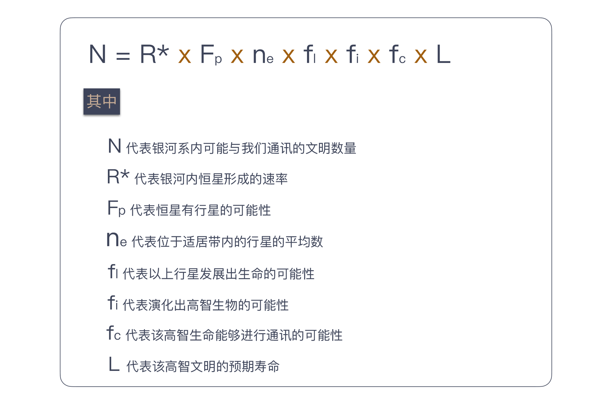

# 11 | 向埃隆·马斯克学习任务分解
    

这次我们从一个宏大的话题开始：银河系中存在多少与我们相近的文明。我想，即便这个专栏的读者主力是程序员这个平均智商极高的群体，在面对这样一个问题时，大多数人也不知道从何入手。

我来做一个科普，给大家介绍一下德雷克公式，这是美国天文学家法兰克·德雷克（Frank Drake）于1960年代提出的一个公式，用来推测“可能与我们接触的银河系内外星球高等文明的数量”。

下面，我要放出德雷克公式了，看不懂一点都不重要，反正我也不打算讲解其中的细节，我们一起来感受一下。

不知道你看了德雷克公式做何感想，但对于科学家们来说，德雷克公式最大的作用在于：**它将一个原本毫无头绪的问题分解了，分成若干个可以尝试回答的问题。**

随着观测手段的进步，我们对宇宙的了解越来越多，公式中大多数数值，都可以得到一个可以估算的答案。有了这些因子，人们就可以估算出银河系内可以与我们通信的文明数量。

虽然不同的估算结果会造成很大的差异，而且我们迄今为止也没能找到一个可以联系的外星文明，但这个公式给了我们一个方向，一个尝试解决问题的手段。

好吧，我并不打算将这个专栏变成一个科普专栏，之所以在这讲解德雷克公式，因为它体现了一个重要的思想：任务分解。

通过任务分解，一个原本复杂的问题，甚至看起来没有头绪的问题，逐渐有了一个通向答案的方向。而“任务分解”就是我们专栏第二模块的主题。

## 马斯克的任务分解

如果大家对德雷克公式有些陌生，我们再来看一个 IT 人怎样用任务分解的思路解决问题。

我们都知道埃隆·马斯克（Elon Musk），他既是电动汽车公司特斯拉（Tesla）的创始人，同时还创建了太空探索公司 SpaceX。SpaceX 有一个目标是，送100万人上火星。

美国政府曾经算过一笔账，把一个人送上火星，以现有技术是可实现的，需要花多少钱呢？答案是100亿美金。如果照此计算，实现马斯克的目标，送100万人上火星就要1万万亿。这是什么概念呢？这笔钱相当于美国500年的GDP，实在太贵了，贵到连美国政府都无法负担。

马斯克怎么解决这个问题呢？他的目标变了，他准备把人均费用降到50万美元，也就是一个想移民的人，把地球房子卖了能够凑出的钱。原来需要100亿美金，现在要降到50万美金，需要降低2万倍。

当然，降低2万倍依然是一个听起来很遥远的目标。所以，我们关注的重点来了：马斯克的第二步是，把2万分解成20×10×100。这是一道简单的数学题，也是马斯克三个重点的努力方向。

先看“20”：现在的火星飞船一次只能承载5个人，马斯克的打算是，把火箭造大一点，一次坐100人，这样，就等于把成本降低20倍。如果你关注新闻的话，会发现 SpaceX 确实在进行这方面的尝试，

再来看“10”：马斯克认为自己是私营公司，效率高，成本可以降到十分之一。他们也正在向这个方向努力，SpaceX 的成本目前已经降到了同行的五分之一。

最后的“100”是什么呢？就是回收可重复使用的火箭。如果这个目标能实现，发射火箭的成本就只是燃料成本了。这也就是我们频频看到的 SpaceX 试飞火箭新闻的原因。

这么算下来，你是不是觉得，马斯克的目标不像最开始听到的那样不靠谱了呢？**正是通过将宏大目标进行任务分解，马斯克才能将一个看似不着边际的目标向前推进。**

## 软件开发的任务分解

好了，和大家分享这两个例子只是为了热热身，说明人类解决问题的方案是差不多的。当一个复杂问题摆在面前时，我们解决问题的一个主要思路是分而治之。

**一个大问题，我们都很难给出答案，但回答小问题却是我们擅长的。**所以，当我们学会将问题分解，就相当于朝着问题的解决迈进了一大步。

我们最熟悉的分而治之的例子，应该是将这个理念用在算法上，比如归并排序。将待排序的元素分成大小基本相同的两个子集，然后，分别将两个子集排序，最后将两个排好序的子集合并到一起。

一说到技术，大家就觉得踏实了许多，原来无论是外星人搜寻，还是大名鼎鼎的马斯克太空探索计划，解决问题时用到的思路都是大同小异啊！确实是这样。

**那么，用这种思路解决问题的难点是什么呢？给出一个可执行的分解。**

在前面两个例子里面，最初听到要解决的问题时，估计你和我一样，是一脸懵的。但一旦知道了分解的结果，立即会有一种“柳暗花明又一村”的感觉。你会想，我要是想到了这个答案，我也能做一个 SpaceX 出来。

但说到归并排序的时候，你的心里可能会有一丝不屑，这是一个学生级别的问题，甚至不值得你为此费脑子思考。因为归并排序你已经知道了答案，所以，你会下意识地低估它。

任务分解就是这样一个有趣的思想，一旦分解的结果出来，到了可执行的步骤，接下来的工作，即便不是一马平川，也是比原来顺畅很多，因为问题的规模小了。

在日常工作中，我们会遇到很多问题，既不像前两个问题那样宏大，也不像归并排序那样小，但很多时候，我们却忘记了将任务分解这个理念运用其中，给工作带来很多麻烦。

举一个例子，有一个关于程序员的经典段子：这个工作已经做完了80%，剩下的20%还要用和前面的一样时间。

为什么我们的估算差别如此之大，很重要的一个原因就在于没有很好地分解任务，所以，我们并不知道要做的事情到底有多少。

前面我们在[“为什么说做事之前要先进行推演？”](http://time.geekbang.org/column/article/76716)文章中，讲到沙盘推演，这也是一个很好的例子，推演的过程就是一个任务分解的过程。上手就做，多半的结果都是丢三落四。你会发现，真正把工作完全做好，你落掉的工作也都要做，无论早晚。

**与很多实践相反，任务分解是一个知难行易的过程。**知道怎么分解是困难的，一旦知道了，行动反而要相对来说容易一些。

在“任务分解”这个主题下，我还会给你介绍一些实践，让你知道，这些最佳实践的背后思想就是任务分解。如果你不了解这些实践，你也需要知道，在更多的场景下，先分解任务再去做事情是个好办法。

也许你会说，任务分解并不难于理解，我在解决问题的过程中也是先做任务分解的，但“依然过不好这一生。”这就要提到我前面所说难点中，很多人可能忽略的部分：可执行。

可执行对于每个人的含义是不同的，对于马斯克而言，他把2万分解成20×10×100，剩下的事情对他来说就是可执行的，但如果你在 SpaceX 工作，你就必须回答每个部分究竟是怎样执行的。

同样，假设我们做一个 Web 页面，如果你是一个经验丰富的前端工程师，你甚至可能认为这个任务不需要分解，顶多就是再多一个获取网页资源的任务。

而我如果是一个新手，我就得把任务分解成：根据内容编写 HTML；根据页面原型编写页面样式；根据交互效果编写页面逻辑等几个步骤。

**不同的可执行定义差别在于，你是否能清楚地知道这个问题该如何解决。**

对于马斯克来说，他的解决方案可能是成立一个公司，找到这方面的专家帮助他实现。对你的日常工作来说，你要清楚具体每一步要做的事情，如果不能，说明任务还需要进一步分解。

比如，你要把一个信息存起来，假设你们用的是关系型数据库，对大多数人来说，这个任务分解就到了可执行的程度。但如果你的项目选用了一个新型的数据库，比如图数据库，你的任务分解里可能要包含学习这个数据库的模型，然后还要根据模型设计存储方案。

不过，在实际工作中，大多数人都高估了自己可执行粒度，低估任务分解的程度。换句话说，如果你没做过任务分解的练习，你分解出来的大部分任务，粒度都会偏大。

只有能把任务拆分得非常小，你才能对自己的执行能力有一个更清楚地认识，真正的高手都是有很强的分解能力。这个差别就相当于，同样观察一个物品，你用的是眼睛，而高手用的是显微镜。在你看来，高手全是微操作。关于这个话题，后面我们再来细聊。

一旦任务分解得很小，调整也会变得很容易。很多人都在说计划赶不上变化，而真正的原因就是计划的粒度太大，没法调整。

从当年的瀑布模型到今天的迭代模型，实际上，就是缩减一次交付的粒度。几周调整一次计划，也就不存在“计划赶不上变化”的情况了，因为我的计划也一直在变。

**如今软件行业都在提倡拥抱变化，而任务分解是我们拥抱变化的前提。**

## 总结时刻

我们从外星人探索和马斯克的火星探索入手，介绍了任务分解在人类社会诸多方面的应用，引出了分而治之这个人类面对复杂问题的基本解决方案。接着，我给你讲了这一思想在软件开发领域中的一个常见应用，分而治之的算法。

虽然我们很熟悉这一思想，但在日常工作中，我们却没有很好地应用它，这也使得大多数人的工作有很大改进空间。运用这一思想的难点在于，给出一个可执行的分解。

一方面，对复杂工作而言，给出一个分解是巨大的挑战；另一方面，面对日常工作，人们更容易忽略的是，分解的任务要可执行。每个人对可执行的理解不同，只要你清楚地知道接下来的工作该怎么做，任务分解就可以告一段落。

大多数人对于可执行的粒度认识是不足的，低估了任务分解的程度，做到好的分解你需要达到“微操作”的程度。有了分解得很小的任务，我们就可以很容易完成一个开发循环，也就让计划调整成为了可能。软件行业在倡导拥抱变化，而任务分解是拥抱变化的前提。

如果今天的内容你只记住一件事，那么请记住：**动手做一个工作之前，请先对它进行任务分解。**

最后，我想请你回想一下，你在实际工作中，有哪些依靠任务分解的方式解决的问题呢？欢迎在留言区写下你的想法。

感谢阅读，如果你觉得这篇文章对你有帮助的话，也欢迎把它分享给你的朋友。
    