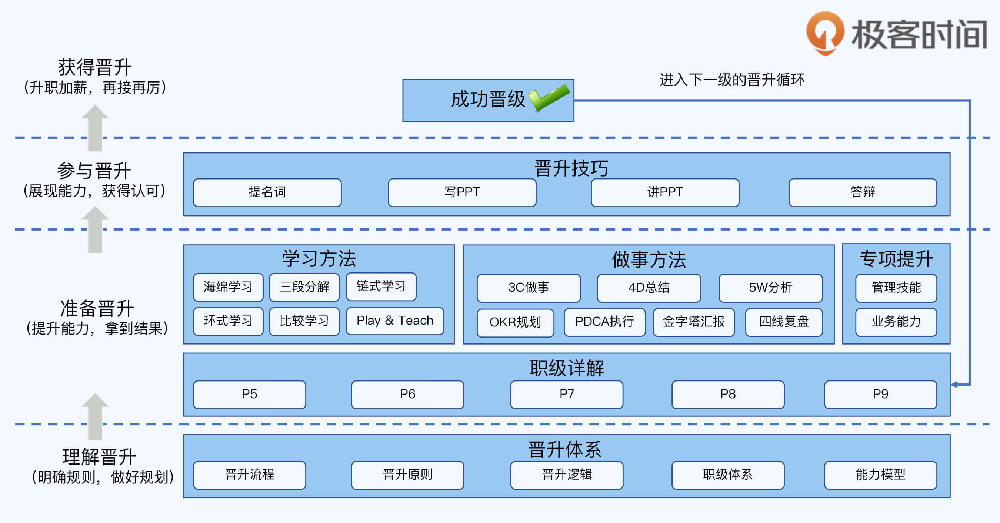
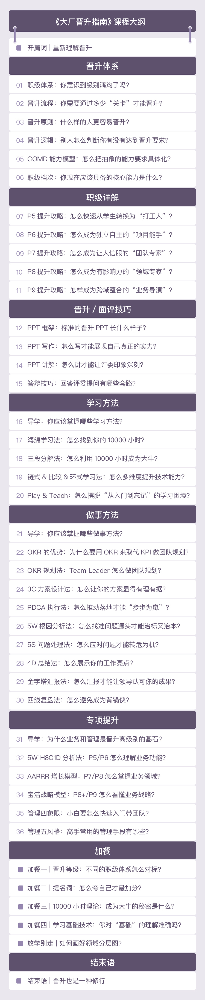

# 大厂晋升指南
  
## 你将获得

*   从 P5 到 P9 的升职秘籍
*   实用的职场晋升技巧
*   19 个高效工作和学习方法
*   完整的职场晋升路线

  

## 讲师介绍

网名“华仔”，前阿里资深技术专家（P9），16 年软件设计开发经验，曾就职于华为、UC、阿里巴巴、蚂蚁金服，带领多个研发团队，承担架构设计、架构重构、技术团队管理、技术培训等职责，先后负责过阿里游戏异地多活、飞鸽消息队列、交易平台解耦、蚂蚁国际澳门钱包等项目，对于高性能、高可用、业务架构、系统解耦等有丰富的经验。

著有《编程的逻辑：如何用面向对象方法实现复杂业务需求》、《从零开始学架构》、《互联网大厂晋升指南》三本书籍，极客时间专栏《从0开始学架构》、《大厂晋升指南》作者，极客时间《架构实战营》视频课讲师。

  

## 课程介绍

在晋升制度背后，有很多人为把控的规则，无法用白纸黑字明确写出来。想获得更好的职业发展，就要理解制度背后的“潜规则”和晋升的运作机制，从模糊的职级描述中解读出明确的要求，并得到主管和评委的认可。

同时，也要实实在在地提升能力，不仅仅是专业技能，比如设计开发、测试、线上保障等；还有做事能力，比如汇报、复盘、协作能力等，做到“两手都要抓、两手都要硬”。

在专栏中，他分享了一套晋升方法论，涵盖“理解晋升→准备晋升→参与晋升→获得晋升”这条完整的晋升链条，将晋升的标准和准备流程清晰化，帮我们找到正确的发力点，真正把劲儿使对地方。

具体来看，内容分为 6 部分，彼此相辅相成，有严密的逻辑关系：

**第一部分：晋升体系。**李运华介绍了职业等级体系和晋升的流程、原则、逻辑，结合自己总结的 COMD 能力评估模型，为你分析不同级别的要求。学完这部分，你会理解晋升是怎样运作的，什么样的人可以晋升，怎么做才能更好地晋升。

**第二部分：职级详解。**结合 COMD 能力模型，他详细解读了从 P5 到 P9 每个级别的具体能力要求，和晋升的关键点与技巧。这样，你就能根据自己的级别，做清晰明确的规划，采取更有效的行动来提升晋升效率。

**第三部分：晋升技巧。**针对面评中的几个关键步骤，他分享了很多实战技巧，包括怎么写 PPT、怎样讲 PPT、如何回应答辩问题等等，让你在面试时充分展现自己的能力，甚至在答辩时超常发挥。

**第四部分：学习方法。**他总结了一套系统的学习方法论，涵盖时间管理、任务拆解、技术提升等多个维度，其中很多是他个人独创的理念和技巧，帮你切实提升个人能力，让自己的技能兼具深度、宽度和广度，在晋升答辩时更易于打动评委。

**第五部分：做事方法。**经过大量实践验证，他总结了的很多做事方法，涵盖端到端的做事流程，包括定目标、执行、总结、汇报和复盘等环节。学完这部分，你不仅能在日常工作中拿到更好的绩效，也能在答辩时展现自己的处事水准。

**第六部分：专项提升。**随着级别的提升，理解业务和管理团队的能力越来越重要。李运华结合自己在业务和管理两大领域的实战经验，提炼成快速入门的套路，帮你掌握不同级别所需要的业务能力，和 50 人以内团队管理技巧。

毫不夸张地说，只要你踏踏实实跟着学，一步一个脚印地提升能力，再结合课程中的经验和技巧，**不敢说每个人都能当上 P9，但职业发展一定更上一层楼。**

  

## 课程目录

  

## 特别放送

#### 免费领取福利

  

#### 限时活动推荐

  

## 订阅须知

1.  订阅成功后，推荐通过“极客时间”App端、Web端学习。
2.  本专栏为虚拟商品，交付形式为图文+音频，一经订阅，概不退款。
3.  订阅后分享海报，每邀一位好友订阅有现金返现。
4.  戳此[先充值再购课更划算](https://shop18793264.m.youzan.com/wscgoods/detail/366k8bbsnpjzcdp?dc_ps=3288312595060320259.200001)，还有最新课表、超值赠品福利等。
5.  企业采购推荐使用“[极客时间企业版](https://b.geekbang.org/?utm_source=geektime&utm_medium=columnintro&utm_campaign=newregister&gk_source=2021020901_gkcolumnintro_newregister)”便捷安排员工学习计划，掌握团队学习仪表盘。
6.  戳此[申请学生认证](https://promo.geekbang.org/activity/student-certificate?utm_source=geektime&utm_medium=caidanlan1)，订阅课程享受原价5折优惠。
7.  价格说明：划线价、订阅价为商品或服务的参考价，并非原价，该价格仅供参考。未划线价格为商品或服务的实时标价，具体成交价格根据商品或服务参加优惠活动，或使用优惠券、礼券、赠币等不同情形发生变化，最终实际成交价格以订单结算页价格为准。
