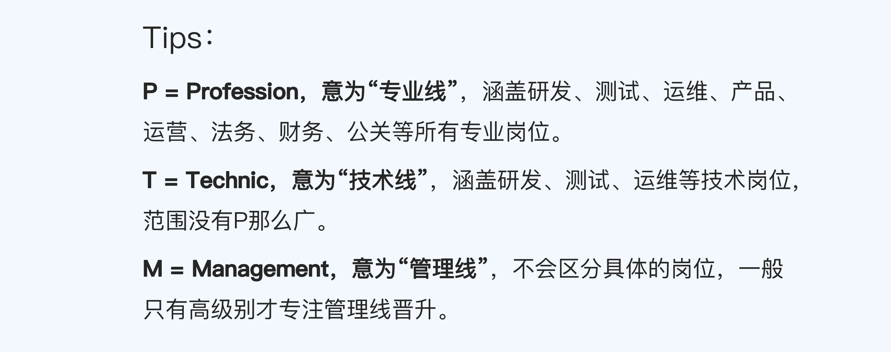
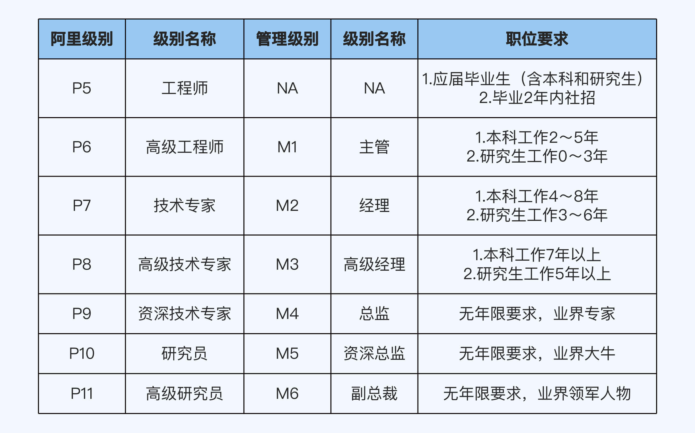
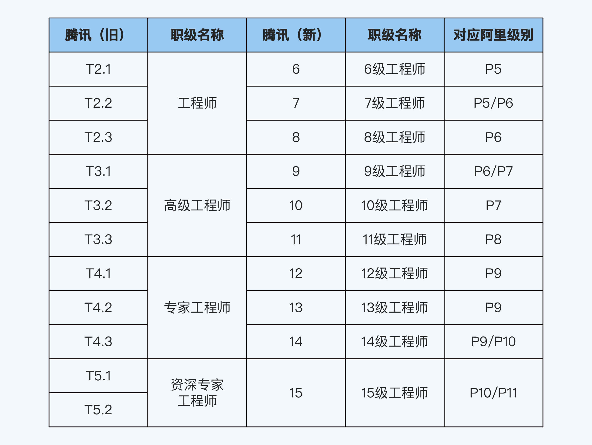
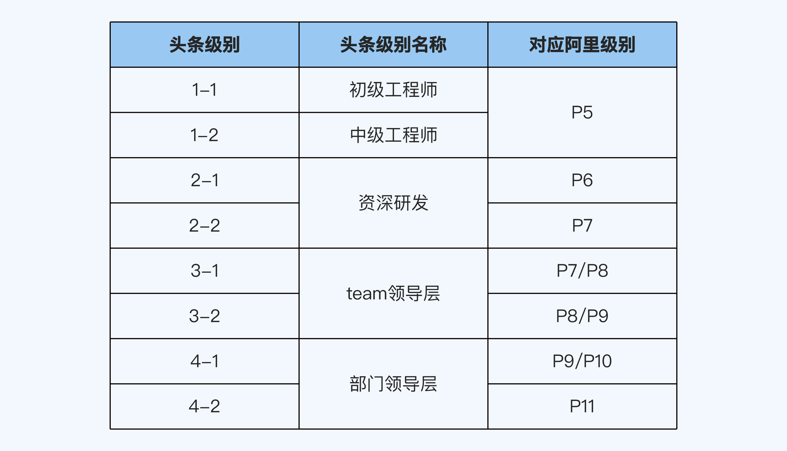
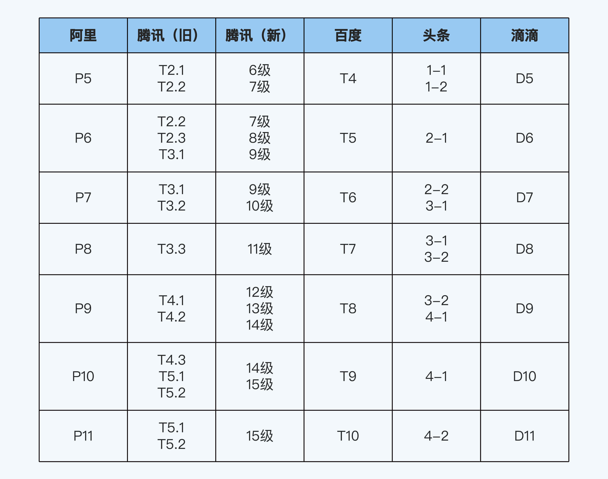
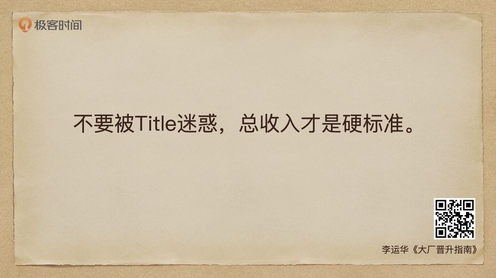

# 加餐一 | 晋升等级：不同的职级体系如何对标？
    
> 你好，我是华仔。

现在，跳槽已经成为职场常态，很多人都是通过跳槽来实现职级的提升和工资的大幅增长。但是，你在跳槽到另一家公司的时候，很可能在评级阶段面临左右为难的尴尬。

如果你的预期过高，而新公司认为你没有达到相应的等级，那么你可能会错失一个很好的工作机会；但如果你要求的级别太低，在谈薪酬股票的时候又会比较吃亏。

这是因为不同的公司采用的职级体系往往也是不同的。你平时要是不关注其他公司的职级体系，在能力对标的时候，就无法准确地评估自己的能力级别和市场行情。

所以，你需要形成合理的自我级别认知，对各个公司的级别对应关系有一个比较明确的了解。

为了让你能够清晰地了解公司之间的级别对应关系，在这一讲中，我挑选了几家最具代表性和最有影响力的大公司作为例子。我会带你分析它们的职业等级信息，让你在面试评级时心里有底，能够自信地向HR和面试官提出自己的要求。

## 对比原则

刚才提到，不同的公司职级体系不同，有的是跨越式职级，有的是阶梯式职级。即使两个公司职级体系类似，在级别设计、岗位名称上也会有很多区别，并没有通用的规范来一一对应。所以，我们需要明确一条通用的标尺，来衡量不同公司的两个岗位是否能够对等。这个衡量标准就是**“年度总收入”**，简单来说，**年度总收入相近的岗位基本可以认为是对等的岗位**。

总收入包括薪资、奖金和股票期权等部分，你可以通过以下渠道去了解：

1.  面试的时候找HR详细了解。
2.  跟BAT或TMD的同事/朋友聊聊。
3.  找猎头聊聊。

因此，你在跳槽的时候首先要明确面试定级到底是什么，尤其是跨越式职级体系。因为它除了明确的级别之外，还可能隐藏的细分等级，比如P6可能还分P6-、P6和P6+。另外， 你也要根据谈的薪资来大概推断一下定级是否合理，这样就避免因为过高的薪资期望而错失机会，也不会因为只看级别而损失一些本来可以拿到的回报。

## 阿里：职级硬通货

从目前整个行业的认可度来看，阿里巴巴的层级可以称得上是行业“硬通货”，所以我先从阿里说起，然后再拿其他公司跟它对比。

阿里采用的是跨越式职级，相邻级别之间的跨度很大，目前技术人员基本上都是从P5开始定级的。你可能在网上还看到过P1～P4的等级，但这几个级别主要是给一些初级职能岗或者外包定级用的。

下面我从P5开始，逐一介绍各个级别的特点。

P5是**应届生定级起点**，包括本科和研究生，以及工作2年内社招高潜人才。

P6是**开发主力**，能够独立承担业务需求的开发任务。优秀的P6可能还会带3～5个人。

P7是**团队核心**，要么作为Team Leader带人，要么作为初级架构师负责子系统的设计开发。

P7有点像王者荣耀的“永恒钻石”段位，很多人到了这个级别就很难再晋升了。它虽然对应的管理级别是**经理**，但通常情况带的人在10个以内，跟很多其他公司的经理相比，团队规模要小得多。所以，P7实际上就是一线的主管而已。

P8是**部门核心**，基本都是带团队的，需要负责一块完整的业务。这里的业务规模可以理解为创业公司的一个初创业务的规模，所以P8去创业公司基本就是CTO了。

P9是**业务核心**或者**行业专家**，基本算是打工的巅峰了，比如著名的安全大神云舒，在阿里时是P9。各路业界专家、科研大牛进阿里也基本都是从P9开始定级的，比如网上出名的王垠，他受邀加入阿里时，面试的岗位也是P9级别。

P10是**业界大牛**，从这个级别开始，我已经不太能够用普通的语言来定义了。

如果说P9是“最强王者”，那么P10就是“荣耀王者”了。现在科大讯飞的副总裁刘鹏，当初拿阿里offer时给了P10；Facebook的HipHop项目负责人赵海平加入阿里的时候，级别也是P10。

P11是**业界领军人物、科学家**。

这个级别既需要天才，还要有运气。比较有名的P11，有江湖人称“道哥”的吴翰清，他是阿里首席安全科学家、阿里云安全负责人；还有阿里合伙人多隆，他是淘宝的第一代程序员，号称淘宝的“扫地僧”。如果还要拿游戏来类比，我愿意称他们是“国服最强”。

我把这些级别的信息整理汇总在这个表格里，方便你查看和对比。

关于阿里的跨越式职级，我还想补充几点：

1.  像工作年限这些信息，都是针对大部分人的情况来说的，**不是绝对的标准**。比如阿里P6，我说“需要工作2～5年”，是因为大多数人工作2～5年可以达到这个级别，但可能有些厉害的人，工作5年就达到P8了。
2.  岗位要求是我根据个人经验做的总结，**不代表公司的详细要求**。实际面试之前，你还是得对照职位描述（JD，Job Description）进行自我评估。
3.  低于阿里P5的级别，我没有做说明和比较，因为现在已经基本不会再定这个级别了。
4.  超过阿里P11的级别，我也没有做说明和比较，因为我对这部分内容并没有什么认知。

## 腾讯：天梯式职级

有了阿里巴巴的职级体系作为基础，我们理解其他公司的职级就轻松多了。接下来，我先说说与阿里并驾齐驱的腾讯。

腾讯在2019年进行了职级的升级，不过现在很多技术人员还是更熟悉腾讯以前职级体系。为了方便理解和交流，我把腾讯新、旧职级体系放在一起来跟阿里对比。它们之间的对应关系如下表所示：

腾讯内部每年会有两次整体评估，如果评估合格，就可晋升一个职等。在旧的体系中，腾讯大部分员工处于T2.3～T3.2区间，这个区间基本上对应了阿里的P6～P7区间。

腾讯的晋升标准主要有两部分：

1.  **硬性指标**，也就是工作年限、考核成绩和是否有重大贡献等。
2.  **答辩**，也就是专业通道面试。

在腾讯，T3（新的9级）是一个门槛。因为通常公司从 T2.3（新的8级）开始会严格要求硬性指标，并且安排严格的晋升面试。

## 百度：此总监非彼总监

百度的级别采用的也是跨越式职级体系，级别数字刚好比阿里小一，所以很方便对比。它们之间的对应关系如下表所示：

和阿里类似，百度的大部分工程师处于T5～T6这个区间。应届生毕业进去会给T2或T3，根据学历和面试表现来定级，低级别阶段一般都能1年1升；从T4开始，晋升的时候需要答辩；从T5开始，晋升就越来越难了。

需要注意的是，这两套体系里的**“总监”**差异还是挺大的。阿里P9对应的管理级别叫“总监”，而百度的“技术总监”是T10，相当于阿里P11的高级研究员，对应到阿里的管理序列是“副总裁”。

简单地说，百度的总监，其实级别要比阿里高不少。

## 头条：升级就像“升官”

了解完老牌的大厂，我们再把目光转向互联网新贵。其中影响最大的，应该就是字节跳动了，为了交流方便，我们还是叫它“头条”吧。头条的级别跟阿里的对应关系如下：

如果只看级别数字编号，头条的职级体系似乎是阶梯式的。但从实际的级别差异来看，它本质上还是跨越式的。比如头条的2-1和2-2，实际上对标的是阿里P6和P7，差别很大。

头条的职级体系还有一个特点是，级别命名比较有特色。3-1以前是按照**专业线**来命名的，比如“初级工程师”。从3-1开始，就变成了按照**管理线**来命名了，例如“team领导层”。

而且，这里的“team”和“部门”覆盖的范围很大。比如头条的3-2相当于阿里的P9，在阿里对应的管理岗位是总监，这个级别管理的范围已经远远不是我们通常所说的“team”这个范围了。因为我们说的一个team，一般是10人以内的小团队。

这种命名方式偏向于从**职责范围**来描述能力，而不是从**专业程度**，在业界也算比较特殊的一类。

## 滴滴：大家都是工程师

至于另一家移动互联网时代崛起的大厂滴滴，它的职级体系跟阿里几乎是完美对应的，具体如下：

虽然滴滴的级别和阿里一一对应，但它的命名辨识度没有阿里那么高。

首先，滴滴所有级别全都叫“工程师”，不像阿里，还会用“工程师”“专家”“研究员”这样的名字以示区分。

其次，滴滴的命名也很有迷惑性，你很难通过名字判断等级高低。比如“专家”和“资深”，并不能很好地区分，“首席”和“杰出”更是难分高下。很多人第一次听到都会被误导，连我一开始也以为“首席”是最厉害的，没想到“平平无奇”的杰出工程师比首席还牛 ：）

## 小结

这一讲以阿里的职级体系为标杆，对比了几个知名公司的职级体系以及与阿里职级的对应关系，希望能够帮助你更好地评估自己在行业中大概的水平位置。

我用一张表格来整理汇总了这几家公司的职级对应关系：

需要注意的是，这个对应关系只是根据级别本身的要求和薪酬来对标的，并不是说实际面试的结果一定遵循这个对应关系。因为决定面试结果的原因，还有你的临场发挥、面试官本身的水平等多种因素。这也是很多人说的“要多面试几家”的原因之一，因为只有综合多次面试结果，才可以更准确地评估自己的水平。

另外，美团的职级体系今年刚刚调整，现在还没有详细的参考资料，所以暂时没有加入对比。如果你有需要，可以在了解详细信息之后，按照我教你的对比原则自己做一个对比。

## 思考题

这就是今天的全部内容，最后留一道课后思考题给你吧。在你曾经的面试经历中，是否有面试定级与自己心理预期差别较大的情况（超出和低于预期都可以），你觉得可能的原因是什么？

    