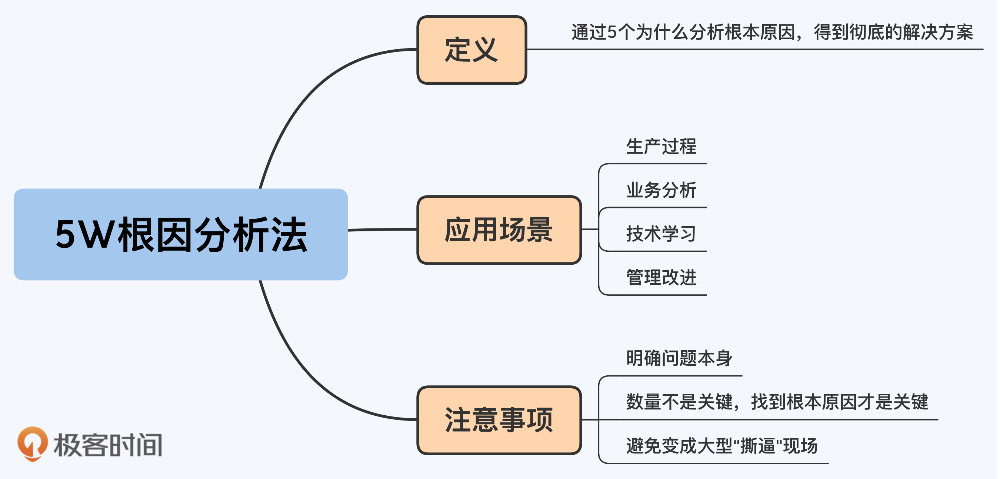
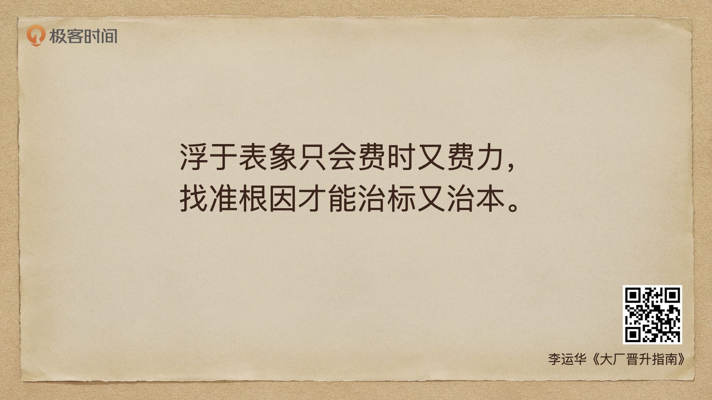

# 26 | 5W根因分析法：怎么找准问题源头才能治标又治本？
    
> 你好，我是华仔。

上一讲我介绍了PDCA执行法，它把执行过程分为四个环节。其中在检查（Check）环节，最容易出现的问题就是，分析原因的时候，**只看到表层的原因，而没有去深挖深层的根本原因**。

这就会导致我们给出的**解决方案治标不治本**，虽然短时间内做了应急处理，但是按下葫芦浮起瓢，相关的问题之后还会接连不断地冒出来。

## 5W根因分析法

怎么解决呢？这就要靠**5W根因分析法**了。它又叫**5Why分析法**或者**丰田五问法**，最初是由丰田集团创始人丰田佐吉提出的，后来成为丰田汽车公司获得成功的重要方法。（老板提出来的，应用也是自然的^\_^）

那么，5W根因分析法到底是什么做的呢？根据丰田汽车公司前副社长大野耐一的描述，就是**重复问五次“为什么”**，问题的本质和解决办法就会变得显而易见。

大野耐一曾经举过这样一个例子：

> 问题1：为什么机器停了？  
> 答：因为机器超载，保险丝烧断了。  
>    
> 问题2：为什么机器会超载？  
> 答：因为轴承的润滑不足。  
>    
> 问题3：为什么轴承会润滑不足？  
> 答：因为润滑泵失灵了。  
>    
> 问题4：为什么润滑泵会失灵？  
> 答：因为它的轮轴耗损了。  
>    
> 问题5：为什么润滑泵的轮轴会耗损？  
> 答：因为杂质跑到里面去了。

如果到了问题1就停止追问，那么工人的措施就是更换保险丝，一段时间后保险丝肯定还会烧断。

如果到了问题4就停止追问，那么工人的措施就是更换轮轴，一段时间后轮轴又会很快坏了。

只有当追问到了问题5，才能找出停机的根本原因，这时工人的措施就是给润滑泵加上防杂质的滤网，从而彻底解决问题。

现在，5W根因分析法在其他很多企业已经得到了广泛应用，并且融入到了各种管理方法中，比如**持续改善法**（日本持续改善之父今井正明提出）、**精益生产法**（美国学者研究丰田后提出的管理哲学）和**六西格玛法**（摩托罗拉提出的管理策略，杰克·韦尔奇推广到通用公司）等。

虽然它起源于生产过程中问题分析，但是作为一种思维方式，可以应用到很多场景，比如业务分析、技术学习和管理改进等。

接下来，我就针对这三类应用场景分别举例说明，这些都是我亲身经历的例子。

## 业务分析

第一个场景是业务分析。

在某交易平台的业务规划目标讨论会上，我通过3个为什么，了解到了业务目标背后的深层考虑。

> 问题1：为什么今年的业务目标是成交金额翻番？  
> 答：因为只有成交金额翻番我们才能达到盈亏平衡点。  
>    
> 问题2：为什么今年要求达到盈亏平衡点？  
> 答：因为集团要求我们的业务能够自负盈亏。  
>    
> 问题3：我们本质上还属于创新业务，为什么集团要求我们的业务能够自负盈亏？  
> 答：因为疫情的影响，集团需要开源节流，减少非盈利业务的持续投入。

你可能觉得有些奇怪：怎么这个例子只问了3个为什么就结束了呢？

因为5个为什么只是一个形象的说法，实际操作中可以是3个，也可以是7个，关键在于通过追问找到根本原因。

虽然在这个例子中，我们还可以继续问下去，比如：“集团为什么要开源节流，创新业务难道不重要吗？”

但这样的问题，业务团队很难得到确切答案，因为集团的决策背景和讨论信息只有高层才知道，而且就算知道答案，也不会对业务规划目标的理解有更多的帮助。

## 技术学习

第二个场景是技术学习。

在某次Netty培训课上，我通过5个为什么，来验证大家是否真的深入理解了Netty网络高性能的核心原理。

> 问题1：为什么Netty网络处理性能高？  
> 答：因为Netty采用了Reactor模式  
>    
> 问题2：为什么用了Reactor模式性能就高？  
> 答：因为Reactor模式是基于IO多路复用的事件驱动模式。  
>    
> 问题3：为什么IO多路复用性能高？  
> 答：因为IO多路复用既不会像阻塞IO那样没有数据的时候挂起工作线程，也不需要像非阻塞IO那样轮询判断是否有数据。  
>    
> 问题4：为什么IO多路复用既不需要挂起工作线程，也不需要轮询？  
> 答：因为IO多路复用可以在一个监控线程里面监控很多的连接，没有IO操作的时候只要挂起监控线程；只要其中有连接可以进行IO操作的时候，操作系统就会唤起监控线程进行处理。  
>    
> 问题5：那还是会挂起监控线程啊，为什么这样做就性能高呢？  
> 答：首先，如果采取阻塞工作线程的方式，对于Web这样的系统，并发的连接可能几万十几万，如果每个连接开一个线程的话，系统性能支撑不了；而如果用线程池的话，因为线程被阻塞的时候是不能用来处理其他连接，会出现等待线程的问题。  
> 其次，线上单个系统的工作线程数配置可以达到几百上千，这样数量的线程频繁切换会有性能问题，而单个监控线程切换的性能影响可以忽略不计。  
> 第三，工作线程没有IO操作的时候可以做其他事情，能够大大提升系统的整体性能。

这种场景在晋升答辩的时候也会经常发生。评委在考察申请者能力的时候，很喜欢用“夺命连环问”，连续追问为什么。如果平时没有训练和积累，你很可能被问到哑口无言的地步。

对于**方案选择**相关的问题，你可以用[第24讲](https://time.geekbang.org/column/article/336582)介绍的**3C方案设计法**，让自己的思考更加全面，选择更加有理有据。

而对于**技术深度**相关的问题，你可以先按照[第19讲](https://time.geekbang.org/column/article/331463)介绍的**链式学习法**学习某项技术，然后再搭配**5W根因分析法**来训练自己，多问自己一些为什么，把深层逻辑吃透。

这样在晋升答辩的时候，你就能从容应对，不用再害怕评委针对技术深度展开“夺命连环问”了。

## 管理改进

在某次项目延迟问题的讨论会上，我通过6个为什么，把项目延迟的核心原因找了出来。

> 问题1：为什么项目延迟了？  
> 答：因为要等测试环境进行测试。  
>    
> 问题2：为什么要等测试环境？  
> 答：我们只有2套测试环境，2套都已经用于另外两个项目了。  
>    
> 问题3：为什么只有2套测试环境，不能搭建多套吗？  
> 答：现在没有机器用来搭测试环境了，而且我们有将近20个子系统，搭建一套可用的测试环境耗时可能要一周。  
>    
> 问题4：为什么会没有机器，直接申请机器不就可以了？  
> 答：运维今年的预算用完了，不能购买新机器了。  
>    
> 问题5：为什么一定要用新机器，测试环境对机器性能要求高吗？  
> 答：测试环境对机器性能要求不高，基本能跑就行。  
>    
> 问题6：那为什么不找运维申请过保机器（使用超过3年的机器，即使没坏也要换掉）用来搭建测试环境？  
> 答：之前没想过这个方案。

所以解决方案很简单，直接找运维借几台过保的机器用来搭建测试环境。

不过这还只是短期的解决方案，实际上在问题3的回答中，我们还可以发现另外一个问题：搭建一套环境太耗时了。

于是测试开发部启动了一个基于Docker的快速搭建环境的项目，项目完成后，任何一个开发或者测试同学花5分钟就能生成一套全新可用的环境。

## 注意事项

通过这3个例子，我想你已经理解了5W根因分析法的使用技巧。在实际应用的时候，我们还需要注意以下3点：

**1\. 问题数量不是关键，找到根本原因才是关键**

在介绍业务分析这个例子的时候，我已经提到，5W或者说5个为什么只是一个形象的说法，3个也可以，7个也可以，关键在于找到根本原因。

所以一个最简单的提问方法就是：**下一个问题是对上一个回答的进一步深入**。

虽然数量可多可少，但我建议不要少于3个，因为凭借3个以下的为什么，大概率找不出根本原因；但是也不要多于7个，因为如果问了7个以上的为什么还没找到根本原因，那就要审视一下问题本身是不是有问题了，比如关注的焦点偏移，前面问的是A，后面变成了问B了。

**2\. 首先要明确问题本身**

5W根因分析法起源于生产过程，通常情况下问题都是比较明显的，比如机器停机了或者次品率升高了。但是，还有很多情况下问题本身其实是不明确的，每个人的理解可能都不太一样。

如果没有明确问题就开始问为什么，无论问题多么精彩都没有意义，甚至越精彩离题越远。

比如“成交量大幅下降”，这个问题就不明确，到底下降10%、30%还是50%才算“大幅”？是同比下降还是环比下降？是某一个子业务下降很多，还是所有子业务都在下降？

如果这些问题都不明确就开始进行根因分析，就很可能得出一大堆似是而非的原因和改进措施。

**3\. 避免变成大型“撕逼”现场**

在连续追问“为什么”的时候，如果双方没有对这个方法充分达成认识，被问的人很可能觉得你在挑战和质疑他，讨论的现场就会变成大型“撕逼”现场，最后闹得不欢而散。

所以在一开始的时候，就要先解释清楚，待会儿将采用5W根因分析法来探讨根本原因，避免挑起情绪对立，引发“撕逼”。

## 小结

现在，我们回顾一下这一讲的重点内容。

1.  5W根因分析法就是通过追问5个为什么来分析问题的根本原因，从而得到彻底的解决方案。
2.  5W根因分析法起源于生产过程的问题原因分析，但也可以应用于业务分析、技术学习和管理改进等场景。
3.  使用5W根因分析法时要注意：首先要明确问题本身；问题数量不是关键，找到根本原因才是关键；避免变成大型“撕逼”现场。  
    

## 思考题

这就是今天的全部内容，留一道课后思考题给你吧。

你是否经历过让自己印象深刻的挫折？试试用5W根因分析法自我分析一下原因，也许这次得出的答案会超出你原有的认知。

欢迎你把答案写到留言区，和我一起讨论。相信经过深度思考的回答，也会让你对知识的理解更加深刻。  

    